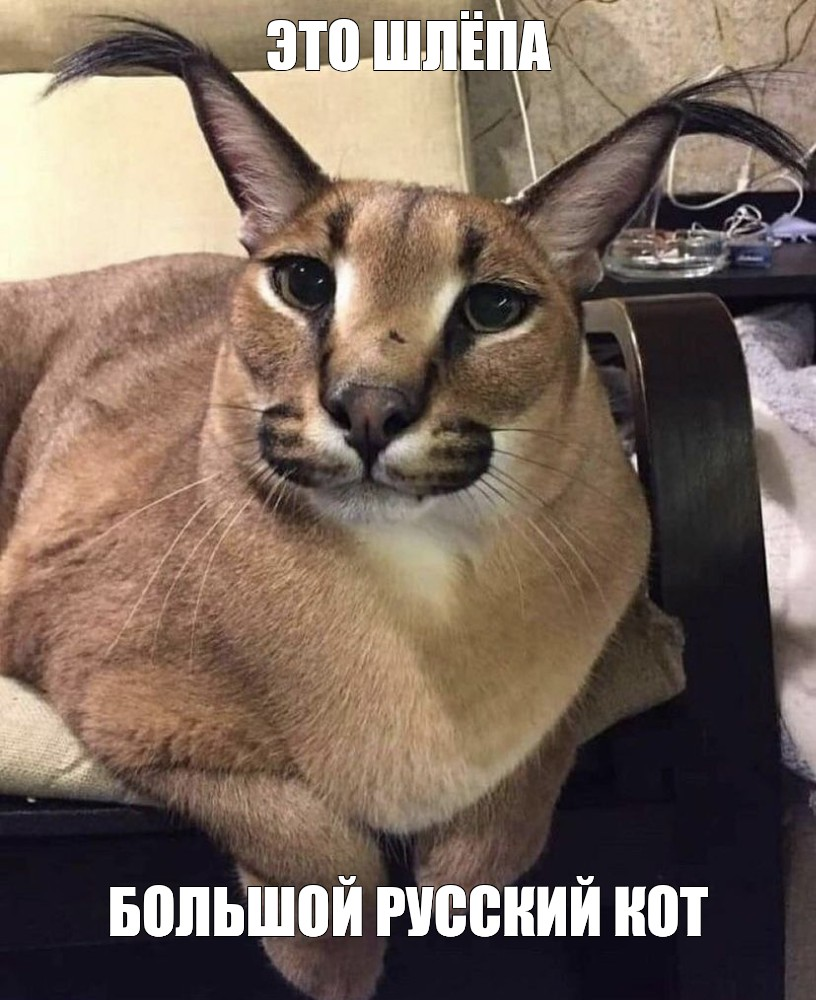

# Супер крутой скрипт от меня (ВСЕ меня знают:anger:)
### Зачем он нужен?:speech_balloon:
Чтобы сделать **крутой** датасет для следующей лабораторной работы.

Можно ввести код валюты и количество дней за которые нужно получить её стоимость (начиная с даты запуска скрипта).
### Версия python и на чём тестировалось:japanese_goblin:
python 3.11.3

Windows 10 x64
### Большой Шлёпа:smirk_cat:

###